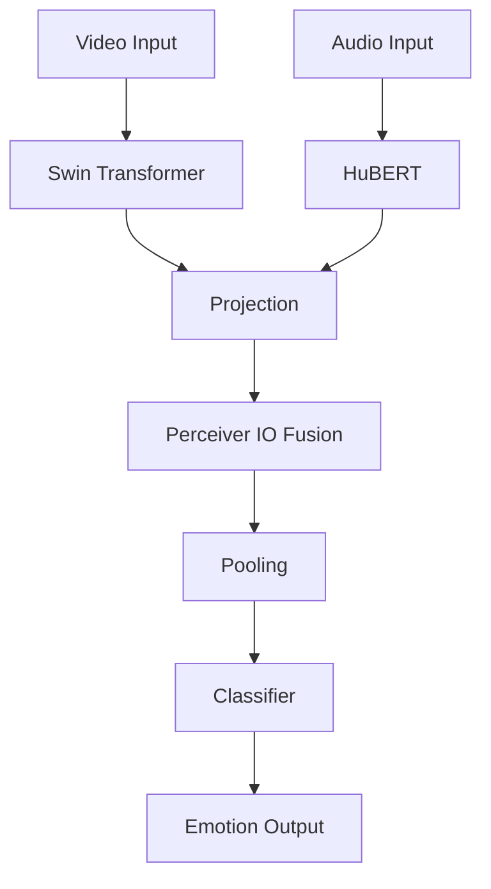
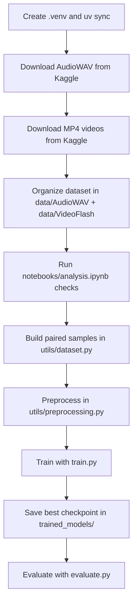
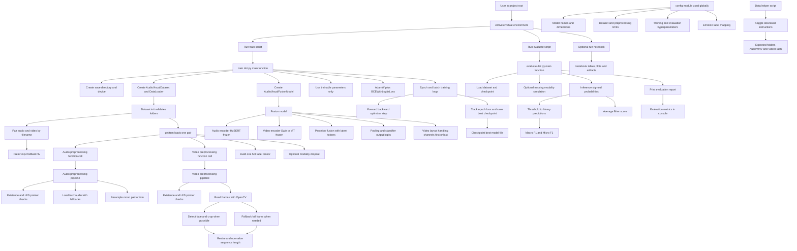
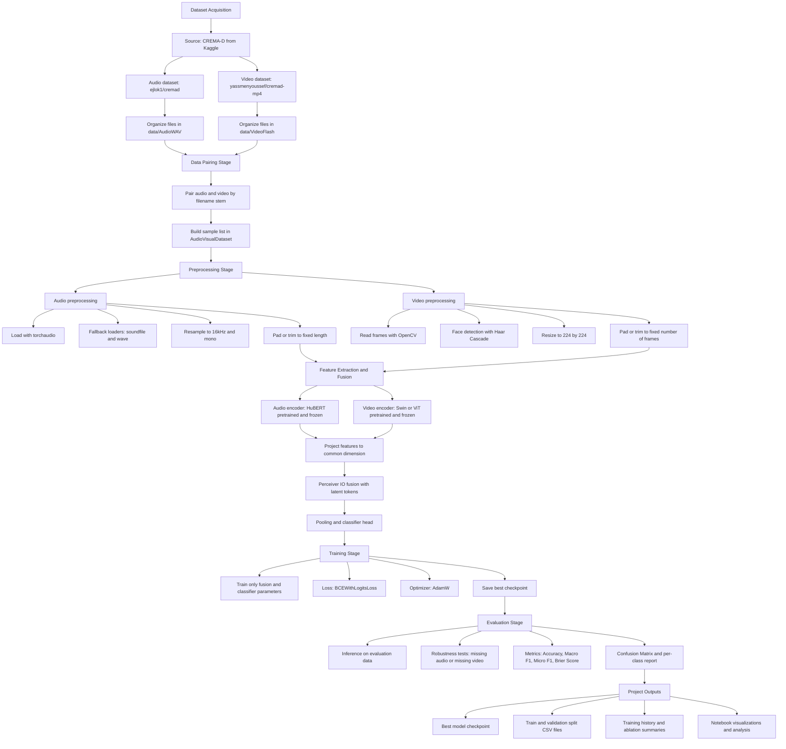

# Robust Audio-Visual Emotion Recognition using Perceiver IO Fusion

## 🚀 Project Overview

This project provides a research-grade implementation for robust audio-visual emotion recognition. It improves upon the model presented in the paper "Contextual Attention for Robust Audio-Visual Emotion Recognition (RAVER)" by leveraging more powerful pre-trained models and a more sophisticated fusion mechanism.

The core idea is to replace the original paper's architecture with state-of-the-art components from HuggingFace and a custom Perceiver IO implementation for modality fusion. This approach aims to achieve higher accuracy, greater robustness to missing modalities, and a more efficient fusion of audio-visual features.

## 🏛️ Model Architecture

The model is composed of three main parts:
1.  **Audio Encoder**: A pre-trained HuBERT model from HuggingFace to extract deep audio features.
2.  **Video Encoder**: A pre-trained Swin Transformer (or ViT) from HuggingFace to extract powerful visual features from facial expressions.
3.  **Fusion Model**: A custom Perceiver IO model that takes the audio and video features, fuses them using cross-attention with a set of learnable latent tokens, and produces a unified representation for emotion classification.

### ✅ Training Strategy Used in This Project

The project now uses **fusion-only training** by default:
- HuBERT encoder weights are frozen.
- Swin/ViT encoder weights are frozen.
- Only fusion layers (`PerceiverIO` + classifier/projection layers) are optimized.

Why this is done:
- Lower memory usage
- Faster training iterations
- More stable local notebook runs
- Avoids full backprop through huge pretrained encoders

### Flowchart



## ↔️ Comparison with RAVER

| Component         | RAVER Paper                | Our Implementation          |
| ----------------- | -------------------------- | --------------------------- |
| **Audio Encoder** | WavLM                      | HuBERT                      |
| **Video Encoder** | MobileNetV2                | Swin Transformer / ViT      |
| **Fusion**        | Transformer Summarizer     | Perceiver IO                |
| **Robustness**    | Modality Dropout           | Modality Dropout            |

## ⚙️ Setup Instructions

1.  **Create and activate a virtual environment using `uv`**:
    ```bash
    uv venv
    source .venv/bin/activate
    ```

2.  **Install the dependencies**:
    ```bash
    uv sync --no-install-project
    ```

    For development dependencies as well:
    ```bash
    uv sync --no-install-project --extra dev
    ```

3.  **Set up HuggingFace token**:
    Create a `.env` file in the root of the `project` directory and add your HuggingFace token:
    ```
    HUGGING_FACE_TOKEN="your_token_here"
    ```
    Alternatively, you can set it as an environment variable.

## 📥 Dataset Setup

### Kaggle (Recommended)
This project expects:
- `data/AudioWAV` (audio)
- `data/VideoFlash` (video)

1. **Install Kaggle CLI**
    ```bash
    uv pip install kaggle
    ```

2. **Authenticate** (token-based)
    Create an API token from Kaggle Account settings and export it:
    ```bash
    export KAGGLE_API_TOKEN="<your_token_here>"
    ```

3. **Download CREMA-D audio (WAV)**
    ```bash
    kaggle datasets download -d ejlok1/cremad
    unzip -o cremad.zip -d data
    ```

4. **Download CREMA-D videos (MP4)**
    ```bash
    kaggle datasets download -d yassmenyoussef/cremad-mp4
    unzip -o cremad-mp4.zip -d data
    mkdir -p data/VideoFlash
    find data -type f -name "*.mp4" -exec cp {} data/VideoFlash/ \;
    ```

5. **(Optional) cleanup duplicates/intermediate files**
    ```bash
    rm -rf data/output_videos
    rm -f cremad.zip cremad-mp4.zip
    ```

6. **Validate files are real media**
    ```bash
    file data/AudioWAV/1001_DFA_ANG_XX.wav
    file data/VideoFlash/1001_DFA_ANG_XX.mp4
    ```
    `AudioWAV` should report RIFF/WAVE audio (not `ASCII text`).

## ✅ Current Project Layout (Working)

Use this dataset layout (already supported by code):

```text
project/
├── data/
│   ├── AudioWAV/
│   └── VideoFlash/
├── utils/
│   ├── dataset.py
│   └── preprocessing.py
├── train.py
├── evaluate.py
└── notebooks/
    └── analysis.ipynb
```

## 📊 Dataset Description

The CREMA-D dataset contains audio-visual recordings of actors speaking short sentences with various emotions.
- **Audio**: WAV files at 16kHz.
- **Video**: MP4 files.
- **Labels**: Extracted from filenames. The emotions are: Anger (ANG), Happy (HAP), Sad (SAD), Neutral (NEU), Fear (FEA), Disgust (DIS).

## 🧪 Notebook Workflow

Primary notebook:
- `notebooks/analysis.ipynb` (all-in-one: data checks, pairing, EDA, preprocessing, model sanity checks)

It now also includes:
- train/val split creation and CSV export
- sample-sized fusion-only training loops (1/3/5 or 5/10/20 configurable)
- confusion matrix and per-class report
- modality ablation (`none`, `audio_missing`, `video_missing`)
- **Macro F1** and **Micro F1** metrics shown directly in notebook outputs
- artifact saving (`epoch_history.csv`, `ablation_summary.csv`, sample checkpoint)

Legacy notebooks may exist, but the recommended flow is to use only `analysis.ipynb`.

To run the notebooks, start a Jupyter server from the project root:
```bash
jupyter notebook
```

## 🔁 End-to-End Working Flow



## 🚆 Training Instructions

1.  **Download the datasets**:
    Make sure you have downloaded the CREMA-D and/or MSP-IMPROV datasets and placed them in the `data/` directory.

2.  **Configure the training**:
    Modify the `config.py` file to set the desired hyperparameters, dataset paths, and model configurations.

3.  **Fusion-only optimization (already wired in code)**:
    - `AudioVisualFusionModel` freezes pretrained encoders.
    - `train.py` optimizes only `model.trainable_parameters()`.
    - `train.py` prints total params vs trainable params.

4.  **Run the training script**:
    ```bash
    python train.py
    ```

### Local Mac Guidance (important)

If running in notebook on a local Mac, use a lightweight configuration:
- `batch_size=1`
- small sampled subsets (for example 32 train / 16 val)
- limit frames per sample (for example first 4 frames)
- limit batches per epoch (for example 1-2)

For full-scale training, prefer a cloud GPU environment (Kaggle/Colab).

## 🗂️ Codebase Walkthrough (What each file does)

### Entry points

- [train.py](train.py)
    - Main function: `train()`
    - Builds dataset + dataloader, initializes model, optimizes fusion-only parameters, and saves best checkpoint.

- [evaluate.py](evaluate.py)
    - Main function: `evaluate(missing_modality=None, missing_rate=0.0)`
    - Loads checkpoint, runs inference, computes Macro F1 / Micro F1 / Brier score, and supports missing-modality experiments.

- [run_pipeline.py](run_pipeline.py)
    - Orchestrator that runs full flow in fixed order:
      1) training
      2) evaluation
      3) final report script
    - Stops on first failure and prints per-step runtime.

### Configuration

- [config.py](config.py)
    - Central config for paths, model names, dimensions, batch size, epochs, and label mappings.

### Dataset and preprocessing

- [utils/dataset.py](utils/dataset.py)
    - `AudioVisualDataset`
        - Pairs audio/video files by filename stem.
        - Calls preprocessing for each sample.
        - Builds target tensors and optional modality dropout.

- [utils/preprocessing.py](utils/preprocessing.py)
    - `extract_frames_from_video(video_path)`
    - `extract_audio_from_path(audio_path)`
    - `get_label_from_filename(filename)`
    - `convert_label_to_multi_label(label)`
    - Also includes safety checks for invalid Git-LFS pointer files.

### Model components

- [models/audio_model.py](models/audio_model.py)
    - `AudioEncoder`: frozen HuBERT + projection.

- [models/video_model.py](models/video_model.py)
    - `VideoEncoder`: frozen Swin/ViT + projection.

- [models/perceiver.py](models/perceiver.py)
    - `Attention`, `CrossAttention`, `PerceiverIO`: fusion building blocks.

- [models/fusion_model.py](models/fusion_model.py)
    - `AudioVisualFusionModel`
    - Freezes pretrained encoders and exposes `trainable_parameters()` for fusion-only optimization.

### Data helper

- [scripts/download_data.py](scripts/download_data.py)
    - Prints commands to download/organize CREMA-D from Kaggle.

## ▶️ Recommended Run Order

1. Prepare environment (`uv venv`, `uv sync --no-install-project`).
2. Download and verify dataset (`data/AudioWAV`, `data/VideoFlash`).
3. Set HuggingFace token in `.env`.
4. Run full orchestrator: `python run_pipeline.py`.

## ⏱️ Expected Runtime (Approximate)

Runtime depends strongly on hardware, frame count, and batch size.

- **Notebook sample mode (small subset, batch=1, few frames):**
    - ~5 to 20 minutes total end-to-end.

- **Local Mac full training (CPU or limited MPS, default heavy settings):**
    - Can take many hours to >1 day and may become unstable if memory is constrained.

- **Cloud GPU (T4/L4/A10 class), fusion-only training:**
    - Usually ~1 to 4 hours for moderate experiments.

- **Full process (setup + download + train + eval):**
    - Fast path (dataset ready + GPU): ~2 to 6 hours.
    - First-time local path (including troubleshooting): often 1+ day.

## 📊 Evaluation Instructions

1.  **Run the evaluation script**:
    To evaluate a trained model, use the `evaluate.py` script. Make sure to specify the path to the trained model checkpoint in the `config.py` file.
    ```bash
    python evaluate.py
    ```

2.  **Experiments**:
    The evaluation script supports running experiments with missing modalities. You can configure the percentage of missing modalities in the `config.py` file.

## 🧩 What Was Updated in Codebase

- Robust video tensor layout handling in fusion forward pass (`channels-first` / `channels-last` support).
- Safer tensor reshaping in video encoder (`reshape` instead of `view` where needed).
- Explicit fusion-only training API in model:
    - `freeze_pretrained_encoders()`
    - `trainable_parameters()`
- Training script updated to optimize only trainable fusion parameters.
- Analysis notebook expanded with in-notebook metrics/plots/tables and F1 scores.

## 🏁 Run Scripts (Quick Commands)

From the project root [project](.):

```bash
# 1) Activate environment
source .venv/bin/activate

# 2) (Optional) print dataset setup commands
python scripts/download_data.py

# 3) Train model (saves best checkpoint in trained_models/)
python train.py

# 4) Evaluate checkpoint
python evaluate.py

# 5) Generate final notebook-style report script output
python scripts/final_notebook_report.py

# 6) (Optional) open notebook flow
jupyter notebook notebooks/analysis.ipynb
```

If you want the full ordered pipeline in one command:

```bash
source .venv/bin/activate && python run_pipeline.py
```

If you want only training + evaluation after setup:

```bash
source .venv/bin/activate && python train.py && python evaluate.py
```

## 🧭 Detailed End-to-End Codebase Flowchart



## 🎓 Faculty Presentation Flowchart (High-Level)


